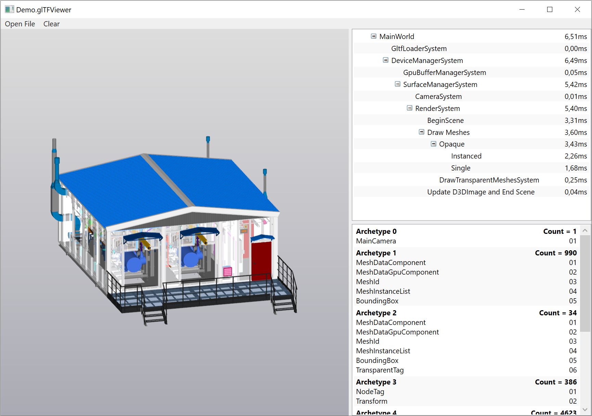

# CSharpEntities
> This project is not under active development
 
`CSharpEntities` is a simple cache-friendly C# ECS (Entity Component System) inspired by [Unity's ECS](https://docs.unity3d.com/Packages/com.unity.entities@0.50/manual/ecs_core.html).

# Table of Contents
- [Project Structure](#project-structure)
- [Code Examples](#code-examples)
    - [Using EntiyManager class](#using-entitymanager-class)
    - [Using World and ComponentSystem classes](#using-world-and-componentsystem-classes)
- [Demo Application glTFViewer](#demo-application-gltfviewer)

# Project Structure
* `CSharpEntities` -- ECS itself
* `CSharpEntities.Wpf` -- system and archetype inspectors WPF controls
* `Demo.glTFViewer` -- comprehensive [demo application](#demo-application-gltfviewer)

# Code Examples

### Using EntityManager class

```c#
struct Position {
    public float Value;
}

struct Velocity {
    public float Value;
}

struct Acceleration {
    public float Value;
}

static class Program {
    public static void Main() {
        var entityManager = new EntityManager();

        entityManager.CreateEntity(
            new Acceleration { Value = 2f },
            default(Position),
            default(Velocity)
        );

        // Creating entity using Archetype explicitly
        {
            var archetype = entityManager.Archetype<Position, Velocity>();
            var entity = entityManager.CreateEntity(archetype);
            entity.Ref<Position>().Value = 10f;
            entity.Ref<Velocity>().Value = -1f;
        }

        var deltaTime = 10f;

        entityManager.ForEach((ref Acceleration a, ref Velocity v) =>
            v.Value += a.Value * deltaTime
        ).Execute();

        entityManager.ForEach((ref Velocity v, ref Position p) =>
            p.Value += v.Value * deltaTime
        ).Execute();

        entityManager.ForEach((in Entity entity, ref Position position) =>
            Console.WriteLine($"Position = {position.Value,5:0.00} | {entity.Archetype}")
        ).Execute();
    }
}
```

Output:

```
Position = 10,00 | Archetype { Position; Velocity; }
Position =  0,00 | Archetype { Position; Velocity; Acceleration; }
```

### Using World and ComponentSystem classes

```c#
using System;
using CSharpEntities;
using CSharpEntities.Systems;


struct Position {
    public float Value;
}


struct Velocity {
    public float Value;
}


struct Acceleration {
    public float Value;
}


public class MainWorld : World {

    public MainWorld() {
        this.RootSystem = new InlineSystem(this, "Root System") {
            new UpdateVelocitySystem(this),
            new UpdatePositionSystem(this),
        };

        this.StartSystems();
    }


    public float DeltaTime { get; private set; }


    public void Update(float deltaTime) {
        this.DeltaTime = deltaTime;
        this.ExecuteSystems();
    }

}


public class UpdateVelocitySystem : ComponentSystem<MainWorld> {

    public UpdateVelocitySystem(MainWorld world) : base(world) {
        this._action = this.Entities.ForEach(
            (ref Acceleration a, ref Velocity v) =>
                v.Value += a.Value * this.World.DeltaTime
        );
    }


    protected override void OnExecute() {
        this._action.Execute();
    }


    private readonly QueryAction _action;

}


public class UpdatePositionSystem : ComponentSystem<MainWorld> {

    public UpdatePositionSystem(MainWorld world) : base(world) {
        this._action = this.Entities.ForEach(
            (ref Velocity velocity, ref Position position) =>
                position.Value += velocity.Value * this.World.DeltaTime
        );
    }


    protected override void OnExecute() {
        this._action.Execute();
    }


    private readonly QueryAction _action;

}


static class Program {
    public static void Main() {
        var world = new MainWorld();

        world.Entities.CreateEntity(
            new Acceleration { Value = 2f },
            default(Velocity),
            default(Position)
        );

        world.Entities.CreateEntity(
            new Velocity { Value = 5f },
            default(Position)
        );

        world.Entities.CreateEntity(
            default(Position)
        );

        var deltaTime = 1f / 60f;
        var duration = 5f;

        for (var i = 0; i < duration / deltaTime; ++i) {
            world.Update(deltaTime);
        }

        world.Entities.ForEach((in Entity entity, ref Position position) => {
            Console.WriteLine($"Position = {position.Value,5:0.00} | {entity.Archetype}");
        }).Execute();
    }
}
```

Output

```
Position = 25,08 | Archetype { Name; Acceleration; Velocity; Position; }
Position = 25,00 | Archetype { Name; Velocity; Position; }
Position =  0,00 | Archetype { Name; Position; }
```

# Demo Application glTFViewer

[glTF](https://en.wikipedia.org/wiki/GlTF) file viewer built using WPF and DirectX 9 (using [SharpDX](http://sharpdx.org/)) demonstrating
how `CSharpEntities` and `CShapEntities.WPF` can be used.

> This is not a general purpose model viewer, it supports only limited number of features and
> will not be able to open every glTF file!

